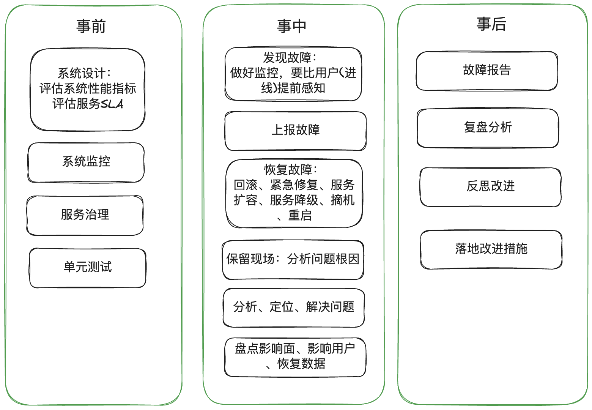

# 系统稳定方法论
前两天在做一次面试的时候，遇到一个问题：当你的XX服务出现线上问题，要怎么处理。当时回答的时候，没有做好梳理，回答的比较杂乱。最近就一直在想这个事情，对自己曾经处理过的一些线上事故进行了梳理，打算输出本系列文章。

## 1. 流程图

## 2. 核心关键
### 2.1 事前
事前就需要有"我在做这个系统的时候，就需要考虑到各方面的问题"的想法,比如说和三方交互，三方出问题怎么办；以及上游突然流量很大，我们该如何做好承压；还有更重要的一点事，我们首要保证核心主链路的正常运转，尽量不要因为代码的问题出现异常情况。（不要小看这个问题，大家有多少线上异常是因为代码bug导致的）。
#### 2.1.1 测试驱动开发（TDD）
测试驱动开发要求在编写某个功能的代码之前先编写测试代码，然后只编写使测试通过的功能代码，通过测试来推动整个开发的进行。
  
我在过的一些互联网公司，都是做好单元测试就可以。在这种开发方式中，代码和单测用例都是开发写的，单测用例能不能通过、怎么写可以通过都是开发心知肚明的，而且在赶进度的情况下，很多单测只是测一下主流程，对于异常分支和情况都不会测试。 
  
后来在跟thoughtworks的朋友聊天的时候，他们是TDD的方式进行。先将各种异常和正常输入的测试用例写好，在写自己功能代码的时候就会会将这些异常情况考虑周全。我个人觉得是比较好的一种开发模式，但是对于节奏快、业务快速调整的国内互联网公司来说，可行性不太大。
#### 2.1.2 服务监控
快速感知故障，最重要的就是系统的监控建设完善和配套的的监控系统。  
  
  首先要解决有无的问题，从机器、到操作系统（CPU、内存、磁盘、IO）、到各种中间件（DB、MQ、Redis）、再到应用层（JVM、接口性能、流量、业务指标）等，是否有配套的监控手段。  

监控指标一般会有如下这些，还有一些机器性能指标。机器(容器)内存、CPU、IO等指标：

#### 2.1.3 评估系统性能指标
> **高性能和业务是强相关的**
1. TP99、吞吐量、延迟
2. 不仅仅要了解后端的性能指标，更要对全链路性能指标有所了解
3. 在实际生产环境，还会涉及 CDN 加速、ISP 路由策略、边缘计算等一系列网络工程层面的性能优化指标，你要在大脑里先建立起整个请求的链路蓝图，熟悉每个环节的性能损耗

在实际的业务场景中，你要关注很多业务相关性指标，比如游戏需要关注
稳定性；视频需要关注延时；电商需要关注一致性
##### 全链路视角分析系统性能指标

#### 2.1.4 服务治理
服务治理就是老生常谈的那些微服务、网关、部署架构。
### 2.3 事中
> 针对处理流程中的 3 个关键环节：发现故障、恢复故障、故障分析。  
 
 在这一阶段，非常依赖个人经验、甚至是对底层原理的掌握深度，还有一些分析工具的使用熟练度。

#### 2.3.1 发现故障
快速发现故障，取决于两个方面：  

1. 对系统是否足够了解？  
a. 对系统架构的了解：出现问题后，你需要知道关联的上下游系统都有哪些？依赖的存储、中间件都有哪些？这样你才会形成很清晰的链路，然后去定位问题出现在哪个环节上？  
b. 对业务的了解：只有对业务足够了解，你才能从业务逻辑上判断它到底是不是故障？这个故障具体是哪个业务环节出问题了？然后再回到系统、服务或者代码层面去做进一步定位。
2. 系统的监控建设是否足够完善  
a. 是否有配套的监控系统：首先要解决有无的问题，从机器、到操作系统（CPU、内存、磁盘、IO）、到各种中间件（DB、MQ、Redis）、再到应用层（JVM、接口性能、流量、业务指标）等，是否有配套的监控手段  
b. 对监控系统的使用是否到位了：有工具了，然后再考虑业务上如何使用好这些工具？要建立哪些监控指标？告警阈值如何进行合理设置？技术同学对于监控系统的使用是否熟练？团队是否有成熟的线上问题处理机制？

#### 2.3.2 快速恢复
　出现故障后的原则一定是：**第一时间恢复，以尽可能地减少对业务的影响。** 。

快速恢复的常见手段有：回滚到上一个版本、紧急修复、服务扩容、服务降级、摘机、重启等。如果涉及到数据库操作，最好是打开binlog日志，便于恢复数据。（或者需要人工找出调整的字段，进行纠错）。还有一些一旦发出去就无法收回的东西，比如说短信，还需要和波及的用户及时沟通。

在恢复故障的同时，还有一件很重要的事情不能遗漏，那就是：**保留现场**，方便后续进行根因分析。

## 2.4 事后

1. 分析问题出现的原因，提交事故报告。
```
这里我们应用记述六要素，时间、地点、人物、起因、经过、结果。

事故评级：

时间：2018年12月3日10:00—2018年12月4日00:00

事故负责人：

事故根因：

解决方案：

波及范围：全国各区域用户（无区域性的事故，可去掉本项）

资损：

事故经过：（结果描述需要具体、真实并且包含影响范围。且时间足够精确）
    起因：2018年12月3日上午10点，官网活动开始，用户大量进入APP，每秒最大并发连接数1.98万，随后，其他活动也开始举行，并发数保持高峰。由于排队人数过多，服务器的响应能力严重不足，导致系统出现了拥堵。

    经过：2018年12月3日10点，官网活动开始，用户大量进入APP，每秒最大并发连接数1.98万，上午11点，每秒最大并发连接数2万；系统报警，开发人员XX紧急检查……

    结果：2018年12月3日10:00起-2019年12月4日00:00，期间APP持续崩溃、闪退，导致所参与的200万用户提交请求出现失败。12月4日凌晨，APP恢复正常。（）

```
2. 基于事故报告进行分析，流程改进、监控改进。看实际情况，判断是否需要写一篇事故分析流程，对问题总结后，后续才会更加小心。同时需要提出合理的改进流程。并持续跟进改进流程的具体实施情况。